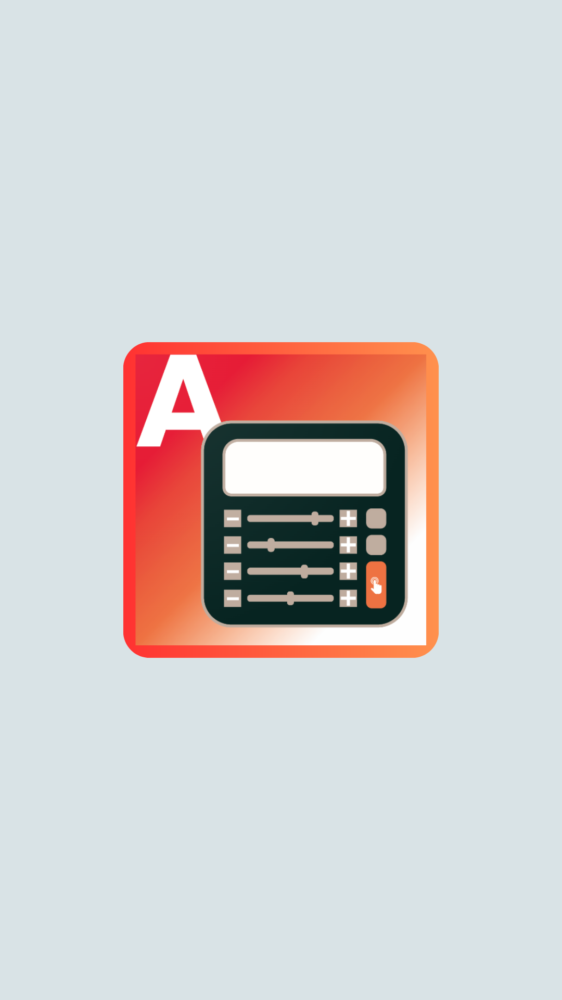
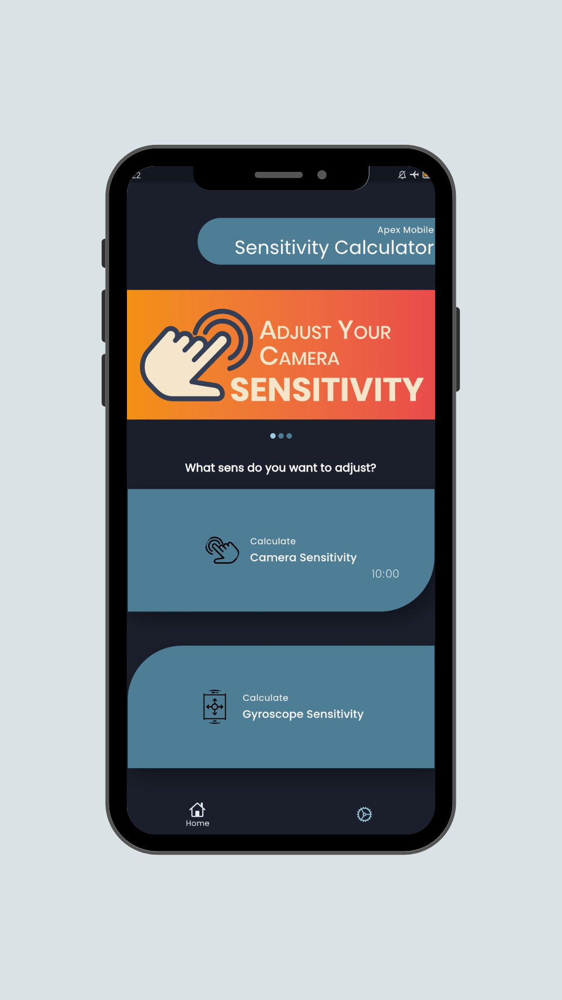

# Hi there, I'm Satria 👋 
#### <h4 align="Center">Welcome to my profile!</h4>
I’m an indie developer who loves to create apps and games that are fun, useful, and original. I enjoy exploring new technologies and learning new skills. This is my showcase of projects that I’ve made or contributed to. Feel free to check them out and let me know what you think.

#### 📫 Reach me at:
- Email: strs.projekt@gmail.com
- Twitter: https://twitter.com/STRSprojekt
- Website: www.strsprojekt.my.id

    
  
  

<h4 align="left">⚙️ Projects</h4>

	<table>
		<tr>
			<td width="50%">
				<h3 align="center">ApexM Sensitvity Calculator</h3>
				
  
					<row>
					
					<a href="https://github.com/STRSprojekt/STRSprojekt/blob/main/apexmsenscalc/Mockup.png" >
						
					</row>
					</a>
					 
					 
          

						  
						
					

					
<strong>Dart, Flutter, Firebase, GetX,</strong>

          

            This Application help Apex Mobile Gamers to improve gameplay by adjusting camera sensitivity and gyroscope sensitivity.
					

Note: Because the game was permanently shut down on May 1, 2023, I stopped developing this application and didn't publish it on Playstore.

          

						  
					

				

			</td>
	</table>

 
